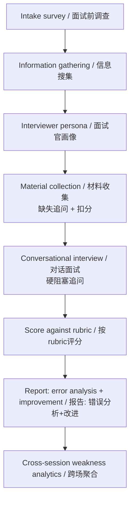
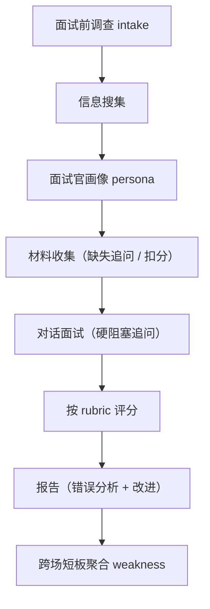

# Research Mock Interview Coach / 科研模拟面试教练

> AI-powered mock interviews for research, grad school & job applications — an agent-agnostic skill with interviewer personas, rubric scoring, and weakness analytics.

   

A high-fidelity **mock interview** skill that any mainstream AI agent can call directly — without being tied to a single agent brand. It prepares you for **research interviews**, **grad school interviews**, **PhD interviews**, and job applications by running interviews that feel real: it collects your materials, probes gaps, scores against a known rubric, and produces a report with error analysis and improvement tips — plus cross-session weakness analytics.

---

## English

### What it does

- **Intake survey** — generates a pre-interview intake file so the interview is tailored to your background, target program, and scenario (e.g. 保研 / 申博 / industry research).
- **Interviewer / company persona** — builds a custom **interviewer persona** (and company/lab persona) from your intake and optional research notes, so questions come from a realistic point of view.
- **Material collection with active follow-up + deduction** — you submit materials; if something is missing the agent **proactively follows up**, and unprovided essentials cost you points via deduction.
- **Pre-defined rubric of deduction points** — the agent knows the "pass criteria" in advance and scores against a published **rubric** of deduction points, just like a real committee.
- **Text & voice interview** — run the interview over text, or with pluggable STT/TTS for a spoken **interview prep** session (mock backend works fully offline).
- **Hard-block follow-up** — when a core question is answered too vaguely, the agent issues a **hard-block follow-up** and will not move on until it is addressed.
- **Report with error analysis + improvement** — after the session you get a report with concrete **error analysis** and **improvement suggestions** (i.e. 面试复盘).
- **Cross-session weakness analytics** — answers from multiple sessions are aggregated into a **weakness analytics / 短板库**, so recurring gaps surface over time.
- **Local-first privacy** — everything runs locally with SQLite storage, BYOK, no telemetry, and a `purge` command to delete your data.

### Why it's different

Most interview tools just dump questions. This one behaves like a **real interview**:

1. **You submit materials** → if they are insufficient, the agent **actively probes** for what's missing instead of pretending everything is fine.
2. **Can't produce it? You lose points.** Material gaps translate into explicit deductions, mirroring how committees actually weigh evidence.
3. **The agent knows the bar in advance.** A pre-defined rubric of deduction points is compared against your performance — you are judged against a known standard, not vibes.
4. **Custom interviewer persona.** Questions are framed from a specific interviewer/lab perspective, not generic prompts.

### Quick start

```bash
cd research-mock-interview
python --version   # need >=3.11, recommend 3.12
pip install -r requirements.txt   # PyYAML optional
python src/cli.py run --demo
```

### How it works



### CLI reference

```bash
# Generate the pre-interview intake file
python src/cli.py intake --out data/intake_me.json

# Build an interviewer/company persona from the intake (+ optional research notes)
python src/cli.py persona --intake data/intake_me.json --out data/persona_me.json

# Offline demo (mock backend: material collection + scoring + report)
python src/cli.py run --demo

# Run with real materials
python src/cli.py run --profile data/sample_profile.json --intake data/intake_me.json --persona data/persona_me.json --scenario 保研 [--voice]

# Export the scoring rubric (catalog of deduction points)
python src/cli.py rubric --out data/my_rubric.json

# Submit materials for a session
python src/cli.py materials --id <session前8位> --add path/to/file

# List sessions / view a report / show weaknesses / aggregate / delete data
python src/cli.py list
python src/cli.py report --id <前缀>
python src/cli.py weakness
python src/cli.py analyze [--scenario 保研] [--out report.md]
python src/cli.py purge --yes
```

### Privacy

- **Local SQLite** — all interview data lives in a local SQLite database.
- **Tenant isolation** — sessions are namespaced so multiple users/profiles don't mix.
- **BYOK (Bring Your Own Key)** — cloud LLM keys come **only** from the environment variable `RMI_LLM_API_KEY` and are **never written to disk**.
- **No telemetry** — the tool collects and reports nothing about you or your usage.
- **Right to delete** — `python src/cli.py purge --yes` removes all stored data.

### Roadmap

See [ROADMAP.md](ROADMAP.md) for the plan (weakness visualization, structured scoring storage, real-voice testing, and more).

### License

Released under the [MIT License](LICENSE).

---

## 中文文档

### 这是什么

**科研模拟面试教练（Research Mock Interview Coach）** 是一个 **agent-agnostic（不绑定任何单一 Agent 品牌）** 的 **模拟面试** Skill，可被各大主流 AI Agent 直接调用。它帮助你为 **科研面试**、**保研面试**、**申博面试（PhD interview）**、**grad school interview** 以及求职科研岗做高还原度的 **interview prep**：先收集材料与定制 **面试官画像**，再像真实面试一样进行（材料收集、硬阻塞追问、基于评分标准的扣分、最终出具带错误分析与改进建议的 **面试复盘** 报告），并支持跨场 **短板库** 聚合分析。本地优先、隐私友好（BYOK、无遥测、数据可删）。

### 核心能力

- **面试前调查（intake）**：生成面试前调查文件，让面试贴合你的背景、目标项目与场景（保研 / 申博 / 企业科研岗）。
- **面试官 / 公司画像（interviewer persona）**：基于调查与可选调研笔记，构建专属 **面试官画像**，让提问来自真实视角。
- **材料收集与缺失追问 + 扣分**：你提交材料；缺失时 agent **主动追问**，必要材料给不出则按规则 **扣分**。
- **预置评分标准 / 扣分点目录（rubric）**：agent 事先知道合格线，对照公开 **rubric** 评分，如同真实委员会。
- **文字 & 语音面试**：支持文本，以及可插拔 STT/TTS 的语音 **interview prep**（mock 后端完全离线）。
- **硬阻塞追问（hard-block follow-up）**：核心问题答得太虚时，agent 发出硬阻塞追问，不解决不往下走。
- **报告：错误分析 + 改进建议**：面试后给出带具体 **错误分析** 与 **改进建议** 的 **面试复盘** 报告。
- **跨场短板聚合（weakness analytics / 短板库）**：多场答案聚合进 **短板库**，让反复出现的短板随时间浮现。
- **本地优先隐私**：本地 SQLite、BYOK、无遥测、`purge` 删除权。

### 为什么不同

多数面试工具只是扔题目。本工具像 **真实面试**：

1. **你提交材料** → 不足时 agent **主动追问**缺失项，而非假装一切正常。
2. **给不出就扣分**：材料缺口转化为明确扣分，对应委员会如何真正权衡证据。
3. **agent 事先知道合格线**：以预置 **rubric** 对照表现，按已知标准评判。
4. **定制面试官画像**：问题从具体面试官 / 实验室视角出发，而非泛化提示词。

### 快速开始

```bash
cd research-mock-interview
python --version   # 需要 >=3.11，推荐 3.12
pip install -r requirements.txt   # PyYAML 可选
python src/cli.py run --demo
```

### 工作原理



### 命令行

```bash
# 生成面试前调查文件
python src/cli.py intake --out data/intake_me.json

# 基于调查（+ 可选调研笔记）构建面试官 / 公司画像
python src/cli.py persona --intake data/intake_me.json --out data/persona_me.json

# 离线演示（mock 后端，含材料收集 + 评分 + 报告）
python src/cli.py run --demo

# 接入真实资料
python src/cli.py run --profile data/sample_profile.json --intake data/intake_me.json --persona data/persona_me.json --scenario 保研 [--voice]

# 导出评分标准（扣分点目录）
python src/cli.py rubric --out data/my_rubric.json

# 提交材料
python src/cli.py materials --id <session前8位> --add path/to/file

# 列出会话 / 查看报告 / 查看短板 / 聚合分析 / 删除数据
python src/cli.py list
python src/cli.py report --id <前缀>
python src/cli.py weakness
python src/cli.py analyze [--scenario 保研] [--out report.md]
python src/cli.py purge --yes
```

### 隐私

- **本地 SQLite**：所有面试数据存于本地 SQLite。
- **租户隔离**：会话按命名空间隔离，多用户 / 多档案不混淆。
- **BYOK**：云端 LLM 密钥**仅**来自环境变量 `RMI_LLM_API_KEY`，**绝不落盘**。
- **无遥测**：不收集、不上报任何使用数据。
- **删除权**：`python src/cli.py purge --yes` 清除全部数据。

### 路线图

见 [ROADMAP.md](ROADMAP.md)（短板可视化、评分结构化落库、真实语音实测等）。

### 许可证

基于 [MIT 许可证](LICENSE) 发布。
