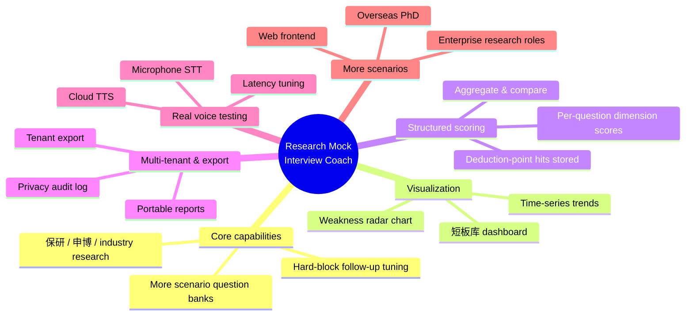
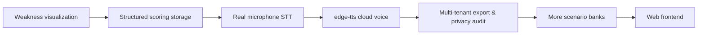

# Roadmap — Research Mock Interview Coach

This roadmap tracks where the **agent-agnostic** `research-mock-interview` skill is heading. Priorities are shaped by what makes a **mock interview** feel real for **research interviews**, **grad school interviews**, **PhD interviews**, and job applications.

## Direction overview / 方向概览



## Near-term plan / 近期计划



### Planned items / 计划项

- [ ] **短板可视化 (Weakness visualization)** — Use radar charts / time-series to show the cross-session weakness distribution and trends. Will be generated with `matplotlib` / `plotly` (offline-friendly). The **短板库** currently aggregates weakness *dimensions*; visualization will make recurring gaps visible at a glance.
  ```mermaid
  flowchart TD
      W[跨场短板维度 aggregated] --> R[Radar chart: dimension coverage]
      W --> T[Time-series: weakness frequency over sessions]
      R --> D[dashboard / report.md embed]
      T --> D
  ```

- [ ] **评分结构化落库 (Structured scoring storage)** — Store each question's per-dimension score and the hit deduction points as structured rows in SQLite, enabling aggregation and comparison across sessions. *Current state: weakness dimensions are already aggregatable; score dimensions are pending structured storage.*

- [ ] **真实麦克风 STT 实测 (Real microphone STT)** — Test real voice input with `vosk` / `whisper` backends (lazy-loaded, optional). Keep the offline `mock` duplex as the default zero-dependency path.

- [ ] **edge-tts 云端配音 (Cloud TTS)** — Add `edge-tts` as a pluggable, lazy-loaded TTS backend for more natural spoken **interview prep** sessions.

- [ ] **多租户导出与隐私审计 (Multi-tenant export & privacy audit)** — Add per-tenant export of all data and a privacy audit log; ensure `purge` coverage is verifiable.

- [ ] **更多场景题库 (More scenario banks)** — Expand question banks for enterprise research roles and overseas **PhD interview** / **grad school interview** tracks.

- [ ] **Web 前端 (Web frontend)** — Optional browser UI for intake, interview, and report viewing while keeping the CLI as the local-first core.

> Nothing here changes the core promise: **local-first, agent-agnostic, no telemetry, BYOK via `RMI_LLM_API_KEY`**.
